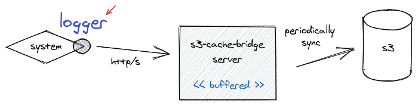

# Logger S3

A library to send logs into S3 via [s3-cache-bridge](https://github.com/lacti/s3-cache-bridge).



## Usage

```typescript
import LogSeverity from "@yingyeothon/logger/lib/severity";
import S3Logger from "@yingyeothon/logger-s3";
import { serializeError } from "serialize-error";

function buildLogFileName(date: Date, severity: LogSeverity) {
  function zeroPad(value: number, length: number) {
    return `0${value}`.slice(-length);
  }
  return [
    "logging",
    "mylog",
    severity,
    date.getFullYear() +
      zeroPad(date.getMonth() + 1, 2) +
      zeroPad(date.getDate(), 2)
  ].join("/");
}

const { logger, flush } = S3Logger({
  // A function to build the S3 Key of logging file.
  asKey: buildLogFileName,

  // Connection information for s3-cache-bridge
  // https://github.com/lacti/s3-cache-bridge#environment
  apiUrl: "http://localhost:3000/", // Or, process.env.S3CB_URL
  // Optional credential for S3CB.
  apiId: "test", // Or, process.env.S3CB_ID
  apiPassword: " test", // Or, process.env.S3CB_PASSWORD

  // Default parameters.
  // Serialize as JSON.
  serializer: (timestamp, level, args) =>
    JSON.stringify({
      level,
      timestamp: timestamp.toISOString(),
      args: args.map(arg => {
        if (arg instanceof Error) {
          return serializeError(arg);
        }
        return arg;
      })
    }) + "\n",
  autoFlushIntervalMillis: 10 * 1000,
  autoFlushMaxBufferSize: 1024,
  severity: "info",
  withConsole: false
});

async function main() {
  try {
    logger.debug(`Hello`, `World`);
    logger.info(`Info with` /*, Some object can be placed in here. */);
  } catch (error) {
    logger.error(`Error occurred`, error);
  }
  await flush();
}
```

### Simplified

If `process.env.S3CB_URL`, `process.env.S3CB_ID` and `process.env.S3CB_PASSWORD` are already set and there is no need to rotate a logging file, it can be simplified like this.

```typescript
import S3Logger from "@yingyeothon/logger-s3";

async function main() {
  const { logger, flush } = S3Logger({
    asKey: () => `logging/mylog/all`
  });
  try {
    logger.debug(`Hello`, `World`);
    logger.info(`Info with` /*, Some object can be placed in here. */);
  } catch (error) {
    logger.error(`Error occurred`, error);
  }
  await flush();
}
```

## License

MIT
